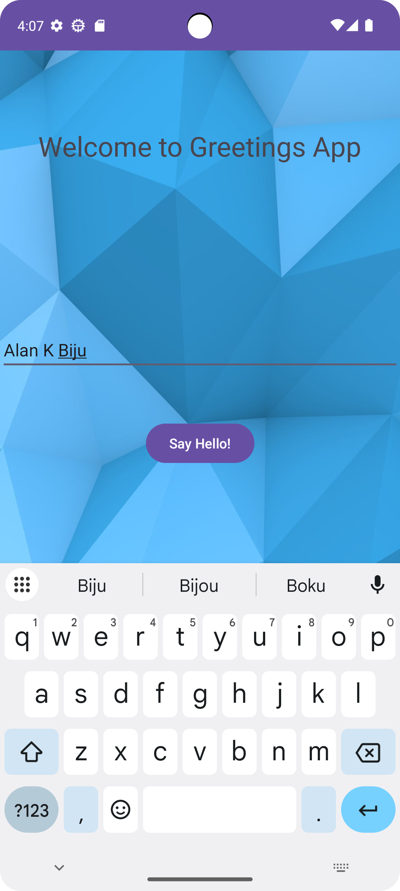
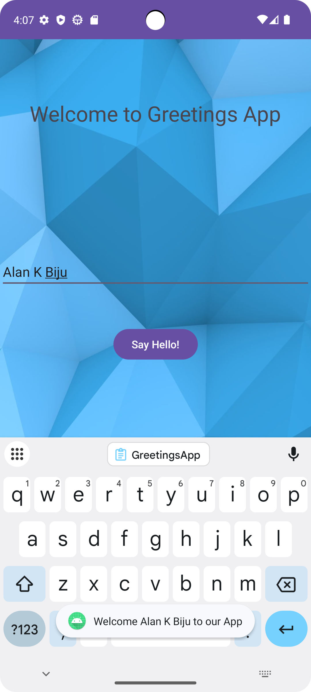

# GreetingsApp 🎉

An Android application that displays personalized greetings to users. This is a sample app for learning Android development using Java/Kotlin.

## 📱 Screenshots

| Home Screen | Greeting Page |
|-------------|----------------|
|  |  |

> Place the screenshots in a folder named screenshots inside the root directory.

## 🚀 Features

- Simple UI with greeting functionality
- Built using Android Studio and Jetpack components
- Great for beginners

## 🛠 Tech Stack

- Android SDK
- Java
- XML Layouts

## 🔒 License

This project is licensed under the MIT License - see the [LICENSE](LICENSE) file for details.
